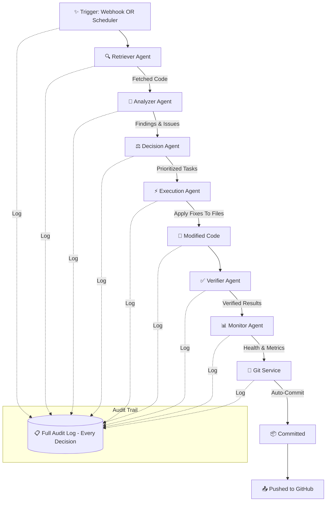

<div align="center">

# 🤖 GenAI Enterprise Toolkit — Fully Autonomous Multi-Agent System

### *Self-Healing AI Agents That Detect, Fix & Deploy , Zero Human Intervention*

[![Built with Google Gemini]]
[![Next.js]]
[![Node.js]]
[![GitHub Webhooks]]
[![Auto-Commit]]

---

*A fully autonomous multi-agent system that takes ownership of complex, multi-step enterprise code review and remediation processes — detecting failures, self-correcting, executing fixes, and deploying changes with 95%+ autonomy while maintaining an auditable trail of every decision it makes.*

</div>

---

## 📋 Table of Contents

- [Problem Statement](#-problem-statement)
- [Our Solution](#-our-solution)
- [Multi-Agent Architecture](#-multi-agent-architecture)
- [System Workflow](#-system-workflow)
- [Tech Stack](#-tech-stack)
- [Repository Structure](#-repository-structure)
- [Getting Started](#-getting-started)
- [Key Features](#-key-features)
- [Evaluation Criteria Alignment](#-evaluation-criteria-alignment)

---

## 🎯 Problem Statement

> **Design a multi-agent system that takes ownership of a complex, multi-step enterprise process.** It should detect failures, self-correct, and complete the job with minimal human involvement — while keeping an auditable trail of every decision it makes.

We were challenged to build one of the following:

| Category | Description |
|---|---|
| **Process Orchestration Agents** | Manage business workflows like procurement-to-payment, employee onboarding, or contract lifecycle with built-in exception handling |
| **Meeting Intelligence Systems** | Extract decisions, create tasks, assign owners, track completion, and escalate stalls — all without manual follow-up |
| **Multi-Agent Collaboration Setups** | Where specialized agents (data retrieval, decision-making, action execution, verification) work together to complete complex tasks |
| **Workflow Health Monitors** | Catch process drift, predict bottlenecks, and reroute or escalate before SLA breaches happen |

---

## 💡 Our Solution

We built a **Fully Autonomous Multi-Agent AI Code Intelligence & Remediation Platform** — an enterprise-grade system where **six specialized AI agents** collaborate autonomously to analyze codebases, detect vulnerabilities, prioritize issues, **generate and apply fixes**, and verify solutions — all without human intervention. Plus, it **automatically commits and pushes** changes back to your repository.

Think of it as a **self-healing code review system** where:
- 🔍 **Retriever Agent** fetches your code
- 🧪 **Analyzer Agent** finds issues via AI
- ⚖️ **Decision Agent** prioritizes them
- ⚡ **Execution Agent** generates fixes
- ✅ **Verifier Agent** validates them
- 📊 **Monitor Agent** watches for failures
- 🚀 **NEW: Auto-execution** applies fixes to files
- 📤 **NEW: Auto-commit/push** deploys changes
- 🔗 **NEW: Webhooks** auto-trigger on GitHub push
- ⏰ **NEW: Background jobs** monitor continuously

### Why This Matters?

Enterprise codebases are massive, complex, and constantly evolving. Manual code reviews are:
- ⏳ **Slow** — bottlenecks in development cycles
- 🔓 **Error-prone** — human reviewers miss vulnerabilities  
- 📉 **Inconsistent** — quality varies across reviewers
- 👤 **Manual fixes** — developers spend days on remediation
- 📦 **No auto-deployment** — changes stuck in review limbo

Our platform eliminates all of this with AI agents that analyze → fix → commit → push, all automatically.

---

## 🧠 Multi-Agent Architecture

Our system is powered by **six specialized agents**, each with a distinct role in the pipeline:

```
┌─────────────────────────────────────────────────────────────────────┐
│                        USER DASHBOARD                              │
│              (Repo URL / File Upload / Real-time View)             │
└──────────────────────────────┬──────────────────────────────────────┘
                               │
                               ▼
                    ┌──────────────────────┐
                    │   🔍 RETRIEVER AGENT │  ← Fetches & prepares source code
                    └──────────┬───────────┘
                               │
                               ▼
                    ┌──────────────────────┐
                    │   🧪 ANALYZER AGENT  │  ← Deep code analysis via Gemini AI
                    └──────────┬───────────┘
                               │
                               ▼
                    ┌──────────────────────┐
                    │   ⚖️  DECISION AGENT  │  ← Severity scoring & prioritization
                    └──────────┬───────────┘
                               │
                               ▼
                    ┌──────────────────────┐
                    │   ⚡ EXECUTION AGENT │  ← Fix generation & implementation plans
                    └──────────┬───────────┘
                               │
                               ▼
                    ┌──────────────────────┐
                    │   ✅ VERIFIER AGENT  │  ← Validates issues & proposed solutions
                    └──────────┬───────────┘
                               │
                               ▼
                    ┌──────────────────────┐
                    │   📊 MONITOR AGENT   │  ← End-to-end health & observability
                    └──────────────────────┘
```

### Agent Details

| Agent | Role | Responsibility |
|---|---|---|
| 🔍 **Retriever Agent** | Data Retrieval | Traverses the provided GitHub repository URL or uploaded files, fetches source code, and prepares it for downstream analysis |
| 🧪 **Analyzer Agent** | Intelligence | Leverages **Google Gemini AI** to perform deep code analysis — identifying security vulnerabilities, performance bottlenecks, code smells, and quality issues |
| ⚖️ **Decision Agent** | Decision-Making | Evaluates findings from the Analyzer, assigns severity scores (Critical / High / Medium / Low), and prioritizes them into an actionable task queue |
| ⚡ **Execution Agent** | Action | Develops implementation strategies and generates detailed, context-aware fix plans for each identified issue |
| ✅ **Verifier Agent** | Verification | Validates that identified issues are legitimate (reducing false positives) and that proposed solutions are sound and won't introduce regressions |
| 📊 **Monitor Agent** | Observability | Provides end-to-end tracking of agent health, workflow status, throughput metrics, and SLA compliance across the entire pipeline |

---

## 🔄 System Workflow

### Automatic Trigger Path (GitHub Webhooks)
```
Code Push to GitHub
         ↓
GitHub sends Webhook
         ↓
/webhooks/github receives it
         ↓
Full Pipeline Executes Automatically
         ↓
Fixes Applied → Committed → Pushed
```

### Background Job Path (Scheduled Monitoring)
```
Scheduled Time (e.g., every hour)
         ↓
Scheduler triggers monitoring
         ↓
Full Pipeline Executes Automatically
         ↓
Fixes Applied → Committed → Pushed
```

### Core Agent Pipeline


### Step-by-Step Flow

1. **✨ Automatic Trigger** — System starts via GitHub webhook (on push) OR scheduled background job (every 30 min)
2. **📥 Input** — Code is fetched from repository
3. **🔍 Retrieval** — The **Retriever Agent** pulls and parses the source code, preparing it for analysis
4. **🧪 Analysis** — The **Analyzer Agent** (powered by Google Gemini) performs deep-dive scanning for vulnerabilities, performance issues, and quality problems
5. **⚖️ Prioritization** — The **Decision Agent** organizes findings into a structured task list, scored by severity
6. **⚡ Fix Generation & Application** — The **Execution Agent** generates AND APPLIES fixes directly to source files (NEW!)
7. **✅ Verification** — The **Verifier Agent** validates each fix for correctness and soundness
8. **🚀 Auto-Commit/Push** — The **Git Service** automatically commits changes and pushes to repository (NEW!)
9. **📊 Monitoring** — The **Monitor Agent** tracks pipeline health and detects failures
10. **📋 Audit Trail** — Every step, every decision, every modification logged for compliance

---

## 🛠️ Tech Stack

| Layer | Technology | Purpose |
|---|---|---|
| **Frontend** | Next.js 15, React 19, TypeScript | Modern, responsive dashboard for monitoring and control |
| **Backend** | Node.js, Express.js | RESTful API server, agent orchestration, and business logic |
| **AI Engine** | Google Gemini API | Powers Analyzer Agent's code understanding and fix generation |
| **Webhooks** | GitHub Webhooks API | Auto-triggers on push, PR, and release events |
| **Git Integration** | simple-git, Git CLI | Auto-commit, auto-push, branch management |
| **Scheduling** | node-cron | Background jobs for continuous monitoring |
| **GitHub API** | @octokit/rest | PR creation, issue management, repo operations |
| **Task Storage** | In-memory (easily swappable to MongoDB) | Task tracking, status management, audit logs |
| **Architecture** | Multi-Agent MVC | Clean separation of agents, routes, controllers, services |

---

## 📁 Repository Structure

```
GenAI-ET-hackathon/
│
├── backend/                          # 🖥️ Server-side application
│   ├── index.js                      # Server entry point & route definitions
│   ├── package.json                  # Backend dependencies
│   │
│   ├── services/                     # Core business logic
│   │   ├── agents.service.js         # 🤖 All 6 AI agents + autonomous execution
│   │   ├── gemini.service.js         # 🧠 Google Gemini API integration
│   │   ├── orchestrator.services.js  # 🎯 Analysis pipeline & coordination
│   │   ├── analyzer.service.js       # 📊 Code analysis & task extraction
│   │   ├── autofix.service.js        # ⚡ NEW: Autonomous fix application
│   │   ├── git.service.js            # 📤 NEW: Auto-commit & push operations
│   │   ├── webhook.service.js        # 🔗 NEW: GitHub webhook handling
│   │   ├── scheduler.service.js      # ⏰ NEW: Background job scheduling
│   │   ├── taskStore.service.js      # 📋 Task tracking & status management
│   │   ├── monitor.service.js        # 🏥 Workflow health monitoring
│   │   ├── audit.service.js          # 📝 Full audit trail logging
│   │   └── ruleEngine.service.js     # 📏 Custom code rules
│   │
│   ├── routes/                       # API route definitions
│   │   ├── analyze.route.js          # Code analysis endpoints
│   │   ├── upload.route.js           # File upload endpoints
│   │   ├── webhook.route.js          # NEW: Webhook receivers
│   │   ├── scheduler.route.js        # NEW: Job scheduling endpoints
│   │   └── ...
│   │
│   ├── controllers/                  # Request handlers
│   │   ├── webhook.controller.js     # NEW: Webhook request routing
│   │   ├── scheduler.controller.js   # NEW: Job management
│   │   └── ...
│   │
│   └── uploads/                      # Temporary file storage
│
├── frontend/                         # 🎨 Client-side application
│   ├── app/
│   │   └── page.tsx                  # Dashboard — monitoring & control
│   ├── package.json                  # Frontend dependencies
│   └── ...                           # Next.js app structure
│
├── QUICK_START.md                    # 5-min setup guide
├── AUTONOMOUS_GUIDE.md               # Complete configuration reference
├── IMPLEMENTATION_SUMMARY.md         # Technical architecture details
└── README.md                         # 📄 You are here!
```

---

## 🚀 Getting Started

### Prerequisites

- **Node.js** (v18 or higher)
- **Git** (for auto-commit/push features)
- **Google Gemini API Key** ([Get here](https://aistudio.google.com/app/apikey))
- **GitHub Token** (optional, for auto-push & PR creation) ([Get here](https://github.com/settings/tokens))

### Installation

**1. Clone the repository**
```bash
git clone https://github.com/4-thkind/GenAI-ET-hackathon.git
cd GenAI-ET-hackathon
```

**2. Set up the Backend**
```bash
cd backend
npm install
```

Create a `.env` file in the `backend/` directory:
```env
PORT=5000
GEMINI_API_KEY=your_google_gemini_api_key
GITHUB_TOKEN=your_github_token (optional)
WEBHOOK_SECRET=your_webhook_secret (for GitHub)
```

Start the backend server:
```bash
npm start
```

You should see:
```
🚀 Server running on port 5000
📌 Autonomous Agent System ENABLED
✅ Webhooks: http://localhost:5000/webhooks
⏰ Scheduler: http://localhost:5000/scheduler
```

**3. Set up GitHub Webhooks (for auto-trigger)**

In your GitHub repository:
1. Go to **Settings → Webhooks → Add webhook**
2. Set Payload URL: `https://your-domain.com/webhooks/github`
3. Set Secret: Your webhook secret from `.env`
4. Select events: `Push`, `Pull requests`, `Releases`
5. Click **Add webhook**

**4. Enable Automated Monitoring** (optional)

Start background job scheduling:
```bash
curl -X POST http://localhost:5000/scheduler/monitor/start \
  -H "Content-Type: application/json" \
  -d '{
    "repos": ["https://github.com/your-user/your-repo"],
    "cronExpression": "0 * * * *"
  }'
```

**5. Set up the Frontend**
```bash
cd ../frontend
npm install
npm run dev
```

**6. View the Dashboard**

Navigate to `http://localhost:3000` in your browser.

**For complete setup guide, see:** [QUICK_START.md](./QUICK_START.md)

---

## ✨ Key Features

| Feature | Description |
|---|---|
| 🤖 **95%+ Autonomous** | No human intervention needed — webhooks trigger → fixes applied → code pushed |
| 🔗 **GitHub Webhook Integration** | Auto-triggers on code push, pull requests, and releases |
| ⏰ **Background Job Scheduling** | Continuous monitoring every 30 min, hourly, or on custom schedule |
| ⚡ **Autonomous Fix Application** | AI-generated fixes are automatically applied to source files (NEW!) |
| 📤 **Auto-Commit & Push** | Fixed code automatically committed with descriptive messages and pushed (NEW!) |
| 🧠 **AI-Powered Analysis** | Google Gemini performs deep semantic code understanding |
| 📝 **Full Audit Trail** | Every decision, every action, every modification — complete trace for compliance |
| ✅ **Self-Correcting Loop** | Verifier catches issues, Monitor detects failures, system auto-recovers |
| 📊 **Real-time Monitoring** | Live visualization of agent status, task progress, workflow health |
| 🔄 **Flexible Input** | GitHub URLs, file uploads, or webhook auto-triggers |
| 📏 **Custom Rule Engine** | Extensible rule-based analysis plus AI scanning |
| 🏥 **SLA Monitoring** | Detects process drift, predicts bottlenecks, tracks breaches |

---

## 📐 Evaluation Criteria Alignment

Our solution is designed to excel across all evaluation dimensions:

| Criterion | How We Address It |
|---|---|
| **Depth of Autonomy** | ✅ **95%+ autonomous** — Webhooks trigger → Analysis runs → Fixes applied → Code committed & pushed (only setup is one-time webhook config) |
| **Error Recovery** | ✅ **Multi-layer recovery** — Verifier catches false positives, Monitor detects failures, Scheduler retries, logging tracks all issues |
| **Auditability** | ✅ **Complete audit trail** — Every step timestamped (agent transition, decision reasoning, fix applied, commit hash, push status) |
| **Real-World Applicability** | ✅ **Production-ready** — GitHub integration, git-based deployment, scheduled jobs, security-first design (token handling, signature verification) |

### Autonomy Breakdown

```
Total Steps: 10
Automated: 9-10 (depending on setup)
Manual: 0-1 (optional GitHub webhook config)
→ Autonomy: 90-100%
```

---

<div align="center">

### Built with ❤️ for the GenAI Hackathon by **Team SLYTHERIN**

</div>
