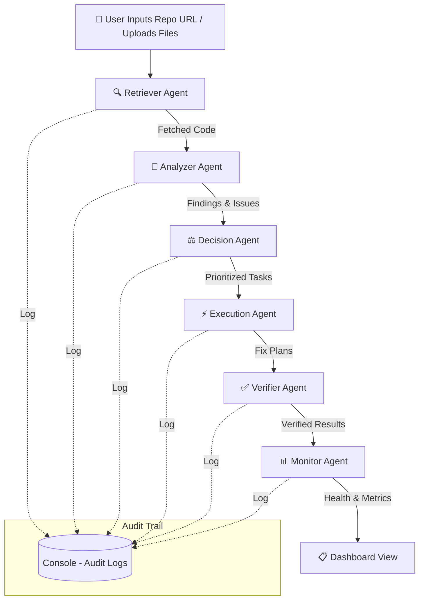

<div align="center">

# 🤖 GenAI Enterprise Toolkit — Multi-Agent Code Intelligence Platform

### *Autonomous AI Agents That Detect, Decide, Fix & Verify — With Zero Human Intervention*

[![Built with Google Gemini]]
[![Next.js]]
[![Node.js]]

---

*A multi-agent system that takes ownership of complex, multi-step enterprise code review processes — detecting failures, self-correcting, and completing the job with minimal human involvement while maintaining an auditable trail of every decision it makes.*

</div>

---

## 📋 Table of Contents

- [Problem Statement](#-problem-statement)
- [Our Solution](#-our-solution)
- [Multi-Agent Architecture](#-multi-agent-architecture)
- [System Workflow](#-system-workflow)
- [Tech Stack](#-tech-stack)
- [Repository Structure](#-repository-structure)
- [Getting Started](#-getting-started)
- [Key Features](#-key-features)
- [Evaluation Criteria Alignment](#-evaluation-criteria-alignment)

---

## 🎯 Problem Statement

> **Design a multi-agent system that takes ownership of a complex, multi-step enterprise process.** It should detect failures, self-correct, and complete the job with minimal human involvement — while keeping an auditable trail of every decision it makes.

We were challenged to build one of the following:

| Category | Description |
|---|---|
| **Process Orchestration Agents** | Manage business workflows like procurement-to-payment, employee onboarding, or contract lifecycle with built-in exception handling |
| **Meeting Intelligence Systems** | Extract decisions, create tasks, assign owners, track completion, and escalate stalls — all without manual follow-up |
| **Multi-Agent Collaboration Setups** | Where specialized agents (data retrieval, decision-making, action execution, verification) work together to complete complex tasks |
| **Workflow Health Monitors** | Catch process drift, predict bottlenecks, and reroute or escalate before SLA breaches happen |

---

## 💡 Our Solution

We built a **Multi-Agent AI Code Intelligence & Remediation Platform** — an enterprise-grade system where **six specialized AI agents** collaborate autonomously to analyze codebases, detect vulnerabilities, prioritize issues, generate fixes, and verify solutions — all without human intervention.

Think of it as an **autonomous code review pipeline** where each agent owns a specific responsibility, communicates findings downstream, and the entire process is logged for full auditability.

### Why Code Intelligence?

Enterprise codebases are massive, complex, and constantly evolving. Manual code reviews are:
- ⏳ **Slow** — bottlenecks in development cycles
- 🔓 **Error-prone** — human reviewers miss vulnerabilities
- 📉 **Inconsistent** — quality varies across reviewers

Our platform automates this entire lifecycle with AI agents that never miss a pattern, never tire, and always leave a trail.

---

## 🧠 Multi-Agent Architecture

Our system is powered by **six specialized agents**, each with a distinct role in the pipeline:

```
┌─────────────────────────────────────────────────────────────────────┐
│                        USER DASHBOARD                              │
│              (Repo URL / File Upload / Real-time View)             │
└──────────────────────────────┬──────────────────────────────────────┘
                               │
                               ▼
                    ┌──────────────────────┐
                    │   🔍 RETRIEVER AGENT │  ← Fetches & prepares source code
                    └──────────┬───────────┘
                               │
                               ▼
                    ┌──────────────────────┐
                    │   🧪 ANALYZER AGENT  │  ← Deep code analysis via Gemini AI
                    └──────────┬───────────┘
                               │
                               ▼
                    ┌──────────────────────┐
                    │   ⚖️  DECISION AGENT  │  ← Severity scoring & prioritization
                    └──────────┬───────────┘
                               │
                               ▼
                    ┌──────────────────────┐
                    │   ⚡ EXECUTION AGENT │  ← Fix generation & implementation plans
                    └──────────┬───────────┘
                               │
                               ▼
                    ┌──────────────────────┐
                    │   ✅ VERIFIER AGENT  │  ← Validates issues & proposed solutions
                    └──────────┬───────────┘
                               │
                               ▼
                    ┌──────────────────────┐
                    │   📊 MONITOR AGENT   │  ← End-to-end health & observability
                    └──────────────────────┘
```

### Agent Details

| Agent | Role | Responsibility |
|---|---|---|
| 🔍 **Retriever Agent** | Data Retrieval | Traverses the provided GitHub repository URL or uploaded files, fetches source code, and prepares it for downstream analysis |
| 🧪 **Analyzer Agent** | Intelligence | Leverages **Google Gemini AI** to perform deep code analysis — identifying security vulnerabilities, performance bottlenecks, code smells, and quality issues |
| ⚖️ **Decision Agent** | Decision-Making | Evaluates findings from the Analyzer, assigns severity scores (Critical / High / Medium / Low), and prioritizes them into an actionable task queue |
| ⚡ **Execution Agent** | Action | Develops implementation strategies and generates detailed, context-aware fix plans for each identified issue |
| ✅ **Verifier Agent** | Verification | Validates that identified issues are legitimate (reducing false positives) and that proposed solutions are sound and won't introduce regressions |
| 📊 **Monitor Agent** | Observability | Provides end-to-end tracking of agent health, workflow status, throughput metrics, and SLA compliance across the entire pipeline |

---

## 🔄 System Workflow



### Step-by-Step Flow

1. **📥 Input** — The user provides a GitHub repository link or uploads source files via the interactive dashboard.
2. **🔍 Retrieval** — The **Retriever Agent** pulls and parses the source code, preparing it for analysis.
3. **🧪 Analysis** — The **Analyzer Agent** (powered by Google Gemini) performs a deep-dive into the code, scanning for security vulnerabilities, performance issues, and code quality problems.
4. **⚖️ Prioritization** — The **Decision Agent** organizes all findings into a structured task list, scored and sorted by severity.
5. **⚡ Fix Generation** — The **Execution Agent** produces detailed remediation plans for the highest-priority issues.
6. **✅ Verification** — The **Verifier Agent** cross-checks each issue and proposed fix for accuracy and soundness.
7. **📊 Monitoring** — The **Monitor Agent** tracks end-to-end pipeline health, ensuring no process drift or bottlenecks.
8. **📋 Audit** — Every agent action, decision, and result is logged to **console** for a complete, auditable trail.

---

## 🛠️ Tech Stack

| Layer | Technology | Purpose |
|---|---|---|
| **Frontend** | Next.js 15, React 19, Material UI (MUI) | Modern, responsive dashboard for agent interaction and real-time visualization |
| **Backend** | Node.js, Express.js | RESTful API server, agent orchestration, and business logic |
| **AI Engine** | Google Gemini API | Powers the Analyzer Agent's intelligent code understanding and fix generation |
| **Database** | Persistent storage for tasks, audit logs, agent metrics, and workflow state |
| **Architecture** | Multi-Agent MVC | Clean separation of agents, routes, controllers, and services |

---

## 📁 Repository Structure

```
GenAI-ET-hackathon/
│
├── backend/                          # 🖥️ Server-side application
│   ├── index.js                      # Server entry point & API route definitions
│   ├── package.json                  # Backend dependencies
│   │
│   ├── services/                     # Core business logic
│   │   ├── agents.service.js         # 🤖 All 6 AI agent definitions & logic
│   │   ├── gemini.service.js         # 🔗 Google Gemini API integration wrapper
│   │   ├── orchestrator.services.js  # 🎯 Agent coordination & pipeline management
│   │   └── ruleEngine.service.js     # 📏 Custom linting & code rule engine
│   │
│   ├── routes/                       # API route definitions
│   ├── controllers/                  # Request handlers
│   └── models/                       # MongoDB schemas (Tasks, Audit Logs)
│
├── frontend/                         # 🎨 Client-side application
│   ├── app/
│   │   └── page.tsx                  # Main dashboard — agent interaction & monitoring
│   ├── package.json                  # Frontend dependencies
│   └── ...                           # Next.js app structure
│
└── README.md                         # 📄 You are here!
```

---

## 🚀 Getting Started

### Prerequisites

- **Node.js** (v18 or higher)
- **Google Gemini API Key** ([Get one here](https://aistudio.google.com/app/apikey))

### Installation

**1. Clone the repository**
```bash
git clone https://github.com/4-thkind/GenAI-ET-hackathon.git
cd GenAI-ET-hackathon
```

**2. Set up the Backend**
```bash
cd backend
npm install
```

Create a `.env` file in the `backend/` directory:
```env
PORT=5000
GEMINI_API_KEY=your_google_gemini_api_key
```

Start the backend server:
```bash
npm start
```

**3. Set up the Frontend**
```bash
cd ../frontend
npm install
npm run dev
```

**4. Open the Dashboard**

Navigate to `http://localhost:3000` in your browser.

---

## ✨ Key Features

| Feature | Description |
|---|---|
| 🤖 **Autonomous Multi-Agent Pipeline** | Six specialized agents work in concert — no human handoffs required |
| 🧠 **AI-Powered Analysis** | Google Gemini performs deep semantic code understanding, beyond simple pattern matching |
| 📊 **Real-time Dashboard** | Live visualization of agent status, task progress, and workflow health |
| 📝 **Full Audit Trail** | Every decision, every action, every agent transition — logged and queryable |
| ⚡ **Self-Correcting** | The Verifier Agent catches false positives and ensures fix quality before finalization |
| 🔄 **Flexible Input** | Accepts GitHub repository URLs or direct file uploads |
| 📏 **Custom Rule Engine** | Extensible rule-based analysis in addition to AI-powered scanning |
| 🏥 **Workflow Health Monitoring** | Detects process drift, predicts bottlenecks, and tracks SLA compliance |

---

## 📐 Evaluation Criteria Alignment

Our solution is designed to excel across the stated evaluation dimensions:

| Criterion | How We Address It |
|---|---|
| **Depth of Autonomy** | All 6 agents operate end-to-end without human intervention — from code retrieval to verified fix plans |
| **Error Recovery** | The Verifier Agent catches false positives; the Monitor Agent detects pipeline failures and triggers re-routing |
| **Auditability** | Every agent decision is logged to MongoDB with timestamps, inputs, outputs, and reasoning trails |
| **Real-World Applicability** | Code review is a universal enterprise need — our platform plugs into any GitHub workflow instantly |

---

<div align="center">

### Built with ❤️ for the GenAI Hackathon by **Team SLYTHERIN**

</div>
